在比赛内用到的基础预训练模型：

比赛中提到的:

视频2D特征 : ResNet50, EfficientNet，inception,  Swin Transformer,  SlowFast, CLIP, Vision Transformer

视频3D特征：S3D,  I3D，TimesFormer, Video Swin Transformer

音频: Mel + VGGish

文本: BERT, Robert-wwm

Speech-To-Text Feature：extracted using the Google Cloud speech API, to extract word tokens from the audio stream, which are then encoded via pretrained word2vec embeddings

[huggingface托管](https://github.com/huggingface/transformers/blob/master/README_zh-hans.md)

常用中文预训练模型:

[ Chinese-BERT-wwm](https://github.com/ymcui/Chinese-BERT-wwm):基于全词遮罩（Whole Word Masking）技术的中文预训练模型BERT-wwm，以及与此技术密切相关的模型：BERT-wwm-ext，RoBERTa-wwm-ext，RoBERTa-wwm-ext-large, RBT3, RBTL3。

- **`BERT-large模型`**：24-layer, 1024-hidden, 16-heads, 330M parameters
- **`BERT-base模型`**：12-layer, 768-hidden, 12-heads, 110M parameters

[中文MacBERT预训练模型](https://github.com/ymcui/MacBERT):**MacBERT** is an improved BERT with novel **M**LM **a**s **c**orrection pre-training task, which mitigates the discrepancy of pre-training and fine-tuning.

- **`MacBERT-large, Chinese`**: 24-layer, 1024-hidden, 16-heads, 324M parameters
- **`MacBERT-base, Chinese`**：12-layer, 768-hidden, 12-heads, 102M parameters

[中文ELECTRA预训练模型](https://github.com/ymcui/Chinese-ELECTRA):谷歌与斯坦福大学共同研发的最新预训练模型ELECTRA因其小巧的模型体积以及良好的模型性能受到了广泛关注。 为了进一步促进中文预训练模型技术的研究与发展，哈工大讯飞联合实验室基于官方ELECTRA训练代码以及大规模的中文数据训练出中文ELECTRA预训练模型供大家下载使用。

- **`ELECTRA-large, Chinese`**: 24-layer, 1024-hidden, 16-heads, 324M parameters
- **`ELECTRA-base, Chinese`**: 12-layer, 768-hidden, 12-heads, 102M parameters
- **`ELECTRA-small-ex, Chinese`**: 24-layer, 256-hidden, 4-heads, 25M parameters
- **`ELECTRA-small, Chinese`**: 12-layer, 256-hidden, 4-heads, 12M parameters

[中文XLNet预训练模型](https://github.com/ymcui/Chinese-XLNet):本项目提供了面向中文的XLNet预训练模型，旨在丰富中文自然语言处理资源，提供多元化的中文预训练模型选择。

- **`XLNet-mid`**：24-layer, 768-hidden, 12-heads, 209M parameters
- **`XLNet-base`**：12-layer, 768-hidden, 12-heads, 117M parameters

MMLAB开源实现：

[MMClassification](https://github.com/open-mmlab/mmclassification/blob/master/README_zh-CN.md)(2D特征)：

-  ResNet: 残差网络

-  ResNeXt:ResNeXt是[ResNet](https://zhuanlan.zhihu.com/p/42706477)[2]和[Inception](https://zhuanlan.zhihu.com/p/42704781)[3]的结合体，不同于[Inception v4](https://zhuanlan.zhihu.com/p/42706477)[4]的是，ResNext不需要人工设计复杂的Inception结构细节，而是每一个分支都采用相同的拓扑结构。ResNeXt的本质是[分组卷积（Group Convolution）](https://zhuanlan.zhihu.com/p/50045821)[5]，通过变量**基数（Cardinality）**来控制组的数量。组卷机是普通卷积和深度可分离卷积的一个折中方案，即每个分支产生的Feature Map的通道数为 n。

SE：Squeeze-and-Excitation的缩写，特征压缩与激发的意思。
  可以把SENet看成是channel-wise的attention，可以嵌入到含有skip-connections的模块中，ResNet,VGG,Inception等等。

- SE-ResNet: 将SE模块嵌入到ResNet中

- SE-ResNeXt: 将SE模块嵌入到ResNeXt中

- RegNet: 结合手动设计与NAS提出了一种新的网络设计范式，由NAS的设计一个单独的网络到设计一个更好的网络设计空间，来获得一族更好的网络模型，并可以从中找到网络设计的通用设计准则，这个过程就叫做网络设计空间的设计。何凯明组2020年CVPR作品

- ShuffleNet:旷世科技提出的方法，结合Group Convolution和Channel Shuffle对Resnet进行改进，可以认为是Resnet的压缩版本。Group Convolution是将输入层的不同特征图进行分组，然后采用不同的卷积核再对各个组进行卷积，这样会降低卷积的计算量。Group Convolution的主要问题是不同组之间的特征图不相互通信，降低了网络的特征提取能力。因此想MobileNet等网络在进行组卷积之后还要使用密集的1x1卷积，保证不同通道之间的信息交换。而ShuffleNet采用了Channel Shuffle方法对经过Group Convolution后的特征图进行“重组”，保证信息在不同组之间流转。如下图中(c)所示。Channel Shuffle并不是随机的，而是“均匀的打乱”。

- MobileNet：核心贡献：将标准的卷积拆分成了Depthwise + Pointwise

  对所有卷积层kernel数量统一乘以缩小因子a来进一步压缩网络

- Swin-Transformer: iccv2021 best paper,解决了计算复杂度问题的VIT

[MMAction2](https://github.com/open-mmlab/mmaction2/blob/master/README_zh-CN.md)(3D特征)：

* [C3D](https://github.com/open-mmlab/mmaction2/blob/master/configs/recognition/c3d/README_zh-CN.md) (CVPR'2014)
* [TSN](https://github.com/open-mmlab/mmaction2/blob/master/configs/recognition/tsn/README_zh-CN.md) (ECCV'2016)
* [ I3D](https://github.com/open-mmlab/mmaction2/blob/master/configs/recognition/i3d/README_zh-CN.md) (CVPR'2017)
* [ I3D Non-Local](https://github.com/open-mmlab/mmaction2/blob/master/configs/recognition/i3d/README_zh-CN.md) (CVPR'2018)
* [R(2+1)D](https://github.com/open-mmlab/mmaction2/blob/master/configs/recognition/r2plus1d/README_zh-CN.md) (CVPR'2018)
* [TRN](https://github.com/open-mmlab/mmaction2/blob/master/configs/recognition/trn/README_zh-CN.md) (ECCV'2018)
* [TSM](https://github.com/open-mmlab/mmaction2/blob/master/configs/recognition/tsm/README_zh-CN.md) (ICCV'2019)
* [TSM Non-Local](https://github.com/open-mmlab/mmaction2/blob/master/configs/recognition/tsm/README_zh-CN.md) (ICCV'2019)
* [ SlowOnly](https://github.com/open-mmlab/mmaction2/blob/master/configs/recognition/slowonly/README_zh-CN.md) (ICCV'2019)
* [SlowFast](https://github.com/open-mmlab/mmaction2/blob/master/configs/recognition/slowfast/README_zh-CN.md) (ICCV'2019)
* [CSN](https://github.com/open-mmlab/mmaction2/blob/master/configs/recognition/csn/README_zh-CN.md) (ICCV'2019)
* [ TIN](https://github.com/open-mmlab/mmaction2/blob/master/configs/recognition/tin/README_zh-CN.md) (AAAI'2020)
* [TPN](https://github.com/open-mmlab/mmaction2/blob/master/configs/recognition/tpn/README_zh-CN.md) (CVPR'2020)
* [ X3D](https://github.com/open-mmlab/mmaction2/blob/master/configs/recognition/x3d/README_zh-CN.md) (CVPR'2020)
* [ OmniSource](https://github.com/open-mmlab/mmaction2/blob/master/configs/recognition/omnisource/README_zh-CN.md) (ECCV'2020)
* [MultiModality: Audio](https://github.com/open-mmlab/mmaction2/blob/master/configs/recognition_audio/resnet/README_zh-CN.md) (ArXiv'2020)
* [TANet](https://github.com/open-mmlab/mmaction2/blob/master/configs/recognition/tanet/README_zh-CN.md) (ArXiv'2020)
* [ TimeSformer](https://github.com/open-mmlab/mmaction2/blob/master/configs/recognition/timesformer/README_zh-CN.md) (ICML'2021)

相关文章:

多模态预训练技术的探索和实践 - 腾讯技术工程的文章 - 知乎 https://zhuanlan.zhihu.com/p/435252076

从多篇2021年顶会论文看多模态预训练模型最新研究进展 - PaperWeekly的文章 - 知乎 https://zhuanlan.zhihu.com/p/425381200

最新多模态预训练模型综述 - 陌陌的文章 - 知乎 https://zhuanlan.zhihu.com/p/430513557

赛尔笔记 | 多模态预训练模型简述 - 忆臻的文章 - 知乎 https://zhuanlan.zhihu.com/p/368770188

多模态中预训练的演变史 - multimodel侠的文章 - 知乎 https://zhuanlan.zhihu.com/p/427323610

> 按结构主要可以分为单流、[双流](https://www.zhihu.com/search?q=双流&search_source=Entity&hybrid_search_source=Entity&hybrid_search_extra={"sourceType"%3A"article"%2C"sourceId"%3A427323610})，单流就是把不同模态特征序列先拼起来，通过transformer进行自注意力，双流就是先各个模态特征单独自注意力，再经过transformer交叉注意力。模型都是大同小异，或者预训练方法有些小的差别，最主要的趋势是预训练数据越来越大。

## **一、预训练技术的研究背景**

### **1.1 预训练研究团队**

预训练技术首先通过大规模无监督或半监督任务使模型能够尽可能多的学习到通用先验知识，然后在下游任务中进行微调，以实现知识的迁移。这种预训练+微调的模型训练方式使得在下游任务中深度模型仅需学习一些任务相关性的知识，而无需重新开始学习，因而能够显著降低下游任务对标注数据的依赖，并提高模型在小数据集上的泛化能力。

上图统计了目前预训练领域的一些团队的研究成果和研究方向。整体而言，目前预训练领域呈现模型参数膨胀，多模态的趋势。对于大型企业而言，由于预训练模型对于企业内部业务的广泛支撑，以及企业自身所拥有的相对充分的计算资源，近两年来，大规模预训练模型已经演化成为大公司在人工智能领域中的“军备竞赛”。

接下来我们首先介绍两种主要的单模态预训练模型：自然语言处理预训练和计算机视觉预训练，然后过渡到目前在产业界和学术界比较火热的多模态预训练模型。

### **1.2 自然语言处理**

近期大规模预训练首先兴起于自然语言处理（Natural Language Processing，NLP）领域。

2013 年 Word2Vec 模型将单词以 embedding 进行密集表示，使得单词与单词之间可以进行相似性度量。之后，单词的 embedding 表示成为了 NLP 领域的主流方向之一。2015 年，Kiros 提出了 Skip-Thought，将无监督预训练从 word-level 拓展到 sentence-level，使得通过长文本进行预训练成为可能。之后，2018 年 Peters 提出 ELMo，通过融合单词的上下文信息，解决了一词多义的问题。这些工作奠定了 NLP 大规模预训练的基础。

2018 年 OpenAI 的 GPT 模型被提出，通过大型预训练语料库 BooksCorpus（包含 7000 本书）和 1.17 亿的参数量在 9 个 NLP 任务中超越了 SOTA。同年，Devlin 提出 BERT，在 11 个 NLP 榜单中都达到了 SOTA，从此开启了 NLP 领域的大规模预训练时代。2018 年至今，T5、GPT-3、M6、盘古等大规模预训练模型相继被发布，模型参数量和训练数据量都呈指数形式爆发，并且在很多下游任务和落地应用中显著提升了模型的性能。

目前 NLP 预训练领域中的相关模型按照研究方向大致可以分为 7 种：

- 多任务：通过堆叠预训练任务，使预训练模型能够更好的学习一些通用先验知识，并且在下游任务中具有更好的泛化性，典型工作如 BERT、RoBERTa。
- 超大规模：通过增大模型参数量和优化模型结构，并且在超大规模半监督或无监督数据集上进行预训练，使得预训练模型能够获得更强的泛化能力，如近期发布的 Pangu 大模型、M6。
- 知识融入：通过融入知识提高模型的泛化能力，典型工作如 K-BERT、KnowBERT。
- 多模态：在模型中融入图像/视频等模态作为补充信息，不仅扩大了模型在多模态任务中的应用前景，同时由于不同模态之间的信息互补，使模型的表征能力大幅提升，如 ImageBERT、ViLBERT。
- 跨语言：将单语言任务推广到多语言任务，典型工作如 XLM、mT5。
- 模型加速：在模型结构上进行优化，在保持模型泛化能力的同时降低模型的参数量，提高模型运行的高效性，如 TinyBERT 和 MiniLM。
- 中文特色：针对中文数据集进行模型改进和训练，如 ERNIE、AMBERT。

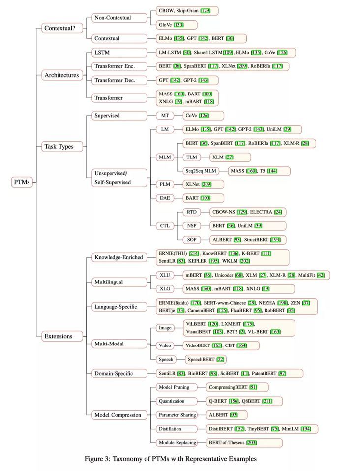

### **1.3 计算机视觉**

如图所示，计算机视觉根据网络结构可以分为两个阶段。在 2020 年之前，CV 领域中的网络模型主要以 CNN 为主。CNN 中所用到的卷积操作因为具有良好的旋转、平移不变性以及强大的局部特征提取能力，天然适合处理图像相关任务。典型工作如 ResNet、GhostNet、Xception 和 EfficientNet。

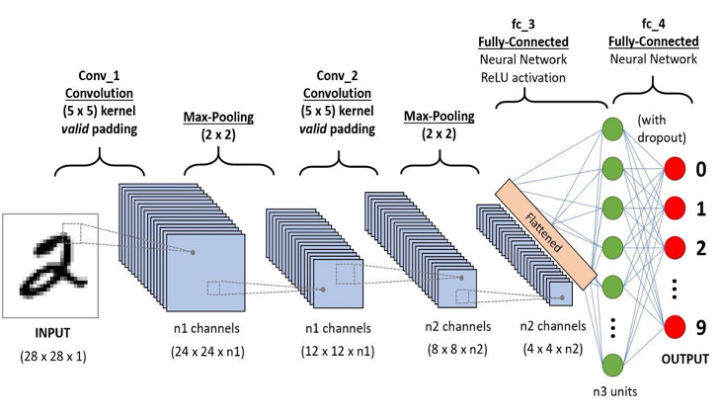

2020 年被提出的 ViT 模型（如图 1.4 所示)挑战了 CNN 在 CV 领域中的主导地位。ViT 在网络结构上没有使用卷积操作，它结合了 Transformer 和 Patch 编码，通过在 JFT-300M 大规模图像数据集上预训练，在多个下游榜单上的性能超过 SOTA CNN 模型。同时，ViT 也通过实验证明了 Transformer 结构对大规模数据的拟合能力。之后，Transformer 结构和大规模预训练成为了 CV 领域的研究热点，一些经典工作，如 ViT、DeiT、CaiT、CCT、LeViT 也相继被提出。

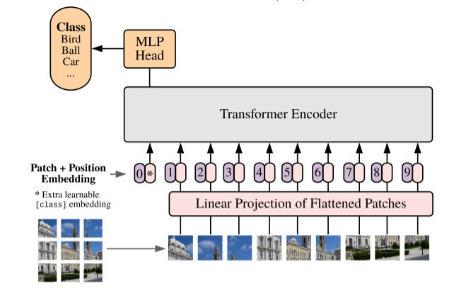

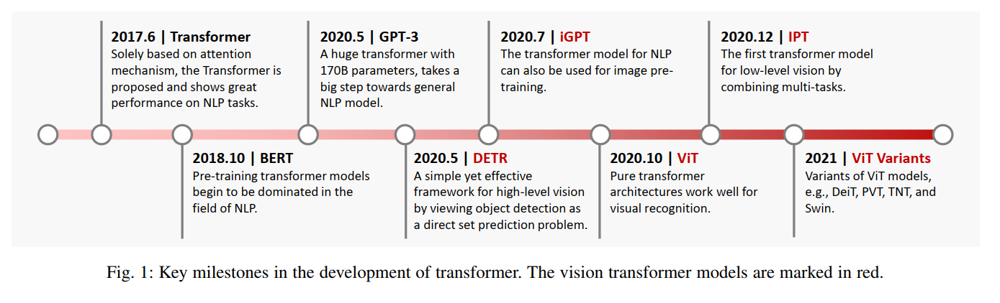

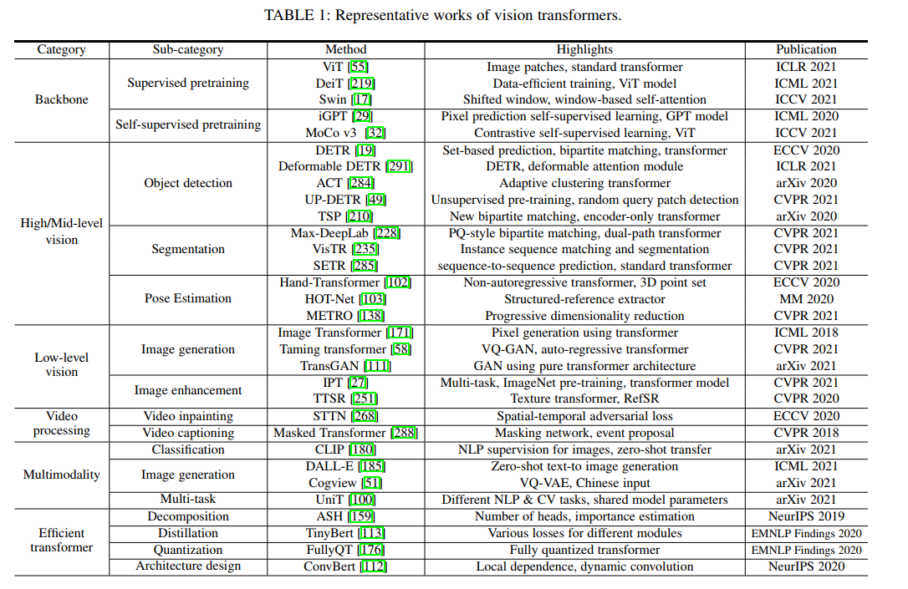

另一种和“微调+预训练”模式比较接近得方法就是对比学习。对比学习同样用的是没有标注的数据，也就是说数据集里只有图片而没有标签。**对比学习的目标是学习一个[编码器](https://www.zhihu.com/search?q=编码器&search_source=Entity&hybrid_search_source=Entity&hybrid_search_extra={"sourceType"%3A"article"%2C"sourceId"%3A425381200})，此编码器对同类数据进行相似的编码，并使不同类的数据的编码结果尽可能的不同**。也就是说对比学习本质上其实就是用了[聚类](https://www.zhihu.com/search?q=聚类&search_source=Entity&hybrid_search_source=Entity&hybrid_search_extra={"sourceType"%3A"article"%2C"sourceId"%3A425381200})的思想：**缩小与正样本间的距离，扩大与负样本间的距离**。如下面的公式所示：

其中 d() 代表样本之间的距离。

现在就能把问题转换成了，如何构建正负样本的问题。如上图所示，大多数都是通过数据增强的方法来创建正负样本的，即，同一张图片进行不同数据增强方法得到样本就是正样本，不同图片数据增强得到的样本就是负样本，然后根据上面聚类的思想来进行训练。因此，大部分对比学习的 pipeline 都如下图所示：

### **1.4 多模态预训练**

单模态表示学习负责将信息表示为计算机可以处理的数值向量或者进一步抽象为更高层的语义特征。多模态表示学习是指通过利用多种模态之间的信息互补性，剔除模态间的冗余特征，从而学习到更好的特征表示。由于其广泛的应用前景，目前已经成为了预训练技术进一步发展的突破口。

多模态预训练技术的产生和兴起的背景因素可以大致概括为三个方面：

1. 通过融合多模态信息，可以扩充模型所能表达的特征空间。由于不同模态之间具有很强的信息互补性，因此通过合适的模型训练，可以得到更具有区分性的特征表示。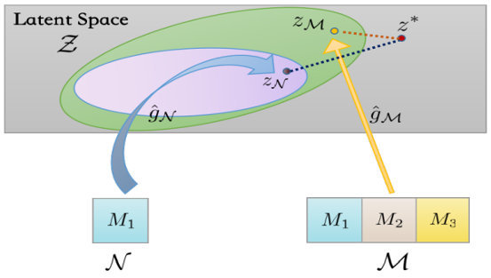
2. 数据来源广：网络上具有庞大的天然图像-文本对（简称图-文对），如图像和自身的标题，图像和围绕图像的描述语。
3. 多模态模型具有广阔的应用前景。如跨模态搜索、图像的标题生成以及人机互动等。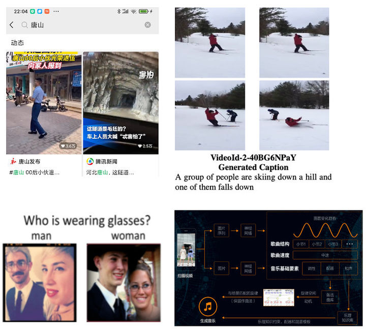

## **二、多模态预训练的现状和趋势**

### **2.1 模型规模**

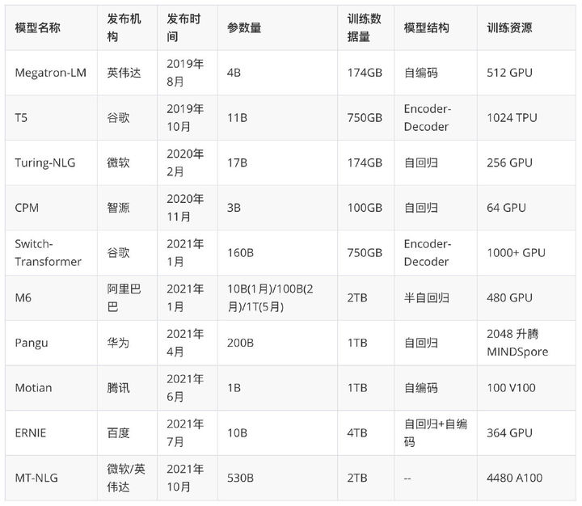

表 2.1 总结了从 2019 年 8 月至 2021 年 10 月的一些典型预训练模型的基本信息。可以看出，随着时间的推移，模型的参数量和训练数据量都呈指数形式扩充。大模型、大数据量成为了目前多模态预训练的发展趋势。此外，由于对训练资源要求较高，多模态预训练领域目前仍以大型企业为主导。

### **2.2 数据集**

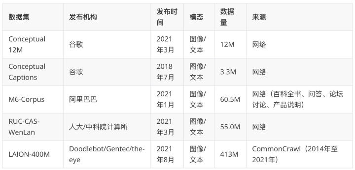

从 2018 年 7 月至 2021 年 8 月，多模态预训练数据规模呈指数上升，数据通常采集自互联网上的图-文对，并且以无监督数据为主。近期最大的多模态预训练数据集**[LAION-400M](https://link.zhihu.com/?target=https%3A//laion.ai/laion-400-open-dataset)**开源，为更大规模的预训练模型提供了数据基础。

### **2.3 常用预训练任务**

由于数据来源等因素，目前的多模态预训练任务仍以无监督学习为基础，以下我们列举一些常用的无监督预训练任务。

**Masked Language Modeling**

随机遮盖文本的某些 token，用其余 token 和其他信息（图像/视频）预测被遮盖的 token。

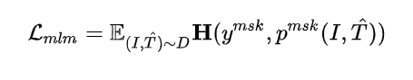

**NSP （Next Sentence Prediction ）** ：

它将训练语料分为两类，一是将 50% 语料构建成正常语序的句子对，比如对于 A-B 句子对，B 就是 A 的实际下一个句子，那么标记为 isnext；二是将 50% 语料构建成非正常语序句子对，B 是来自语料库的随机句子，标记为 notnext。然后模型预测 B 到底是不是 A 句子的下一个句子，使模型**具有句子级别的识别能力** 。

**Image-Text Matching**

根据图像/视频和它对应的文本构造正负图-文对。

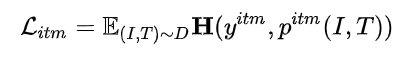

**Augmentation-based Contrastive Learning (by MOCO)**

对图像随机增强两次，来自同一原始图像的样本构成正样本对，否则为负样本对。

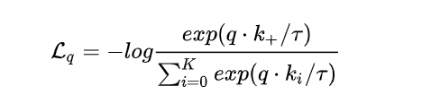

**Prefix Language Modeling**

根据文本前面的 token 生成后面的 token，其中图像信息作为文本模态的先验。

先遮盖图像中某些表示物体的区域，然后用图像的其他区域信息回归被遮盖的区域。

目前的研究标明，用生成方式（如 Prefix Language Modeling 和 Masked Region Feature Regression）进行模型预训练，在某些下游任务中会获得更强的泛化能力。

**MRM 预训练任务 （MRC）**

在 Masked Region Classification（MRC）预训练任务中，需要在 [region token](https://www.zhihu.com/search?q=region+token&search_source=Entity&hybrid_search_source=Entity&hybrid_search_extra={"sourceType"%3A"article"%2C"sourceId"%3A425381200}) 中随机 mask 掉一些 token，然后根据其他的图片 token 和所有的文本 token 来预测这些被 mask 的 token。具体来说就是，每个 region 都会有 Faster R-CNN 得到一个 label，模型需要预测 mask token 的类别，使之和 Faster R-CNN 的 label 相同。

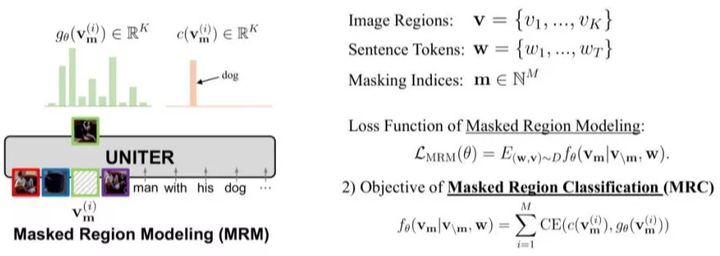

**MRM 预训练任务 （MRC-KL ）**

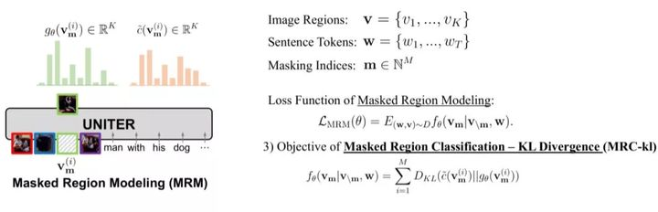

在 Masked Region Classification-KL Divergence（MRC-KL）预训练任务中，同样是随机 mask region token，但是不同的这里不是做分类任务，而是需要计算 Faster R-CNN 特征和 Mask region 的分布差异，使得 Mask region 的分布和 Faster R-CNN 特征的分布尽可能相似，所以损失函数用的是 KL [散度](https://www.zhihu.com/search?q=散度&search_source=Entity&hybrid_search_source=Entity&hybrid_search_extra={"sourceType"%3A"article"%2C"sourceId"%3A425381200})。

**视频-文本单模态表示空间对齐（video-text joint）** 

为了利用BERT来帮助模型获得更好的视频表示，作者设计了视频-文本单模态表示空间对齐任务。该任务具体是，构造正例对（视频与对应/相近的文本）和负例对（视频与不相关的文本），希望正例对中的视频表示与文本表示更接近而负例对中的更远。其中，视频表示由视频单模态编码器得出，文本表示由文本单模态编码器得出。

**条件掩蔽文本预测（conditioned masked language model）**

 与BERT的设计思路类似，作者设计条件掩蔽文本预测任务来训练模型。文本中的词被随机替换成占位符[MASK]，然后替换后的文本与视频进行联合表示后，预测替换前的词。

**掩蔽帧预测（conditioned masked frame model）** 

输入的视频帧被随机替换成占位符号，然后使用模型来预测被替换的视频帧。由于直接预测原始的RGB视频帧非常困难，因此作者使用对比学习的方法，希望原始视频帧与模型相应位置得到的表示相关性更高。

**视频-文本对齐（video-text alignment）** 

视频与相应的文本之间对齐标签为1，而与其他文本对应的标签为0。使用这个对齐信息作为监督信号训练模型。

**文本重构（language reconstruction）**

 为了使得模型能够应用到下游任务-视频描述生成上，作者设计了文本重构任务。具体采用了一个自回归解码器，其输入为处理后的文本和视频帧，输出是原始的文本。

### **2.4 下游任务**

一个预训练模型可以同时支撑多个下游任务，如 VQA、Image Captioning、Text-Image Retrieval 等，表 2.3 列举了一些常见的下游任务。

### **2.5 业界应用现状**

大规模预训练模型不仅在各个任务 benchmark 上取得了非常好的效果，同样具有非常重要的落地应用，以下我们列举一些成功的应用例子。

**盘古（华为）**

盘古（Pangu）大模型具有高达 200B 的参数量，训练数据集达到了 1TB。凭借着优异的性能得到了业界的广泛认可。目前华为依托盘古大模型，在 NLP 大模型、CV 大模型、多模态大模型和科学计算大模型四个领域开始布局，并且提供了对外服务接口：**[https://www.huaweicloud.com/product/modelarts/pangu.html](https://link.zhihu.com/?target=https%3A//www.huaweicloud.com/product/modelarts/pangu.html)**

**M6（阿里巴巴）**

目前 M6 模型已经作为 AI 助理设计师上岗了犀牛智造，通过结合潮流趋势，辅助设计师进行快速设计、模拟试穿效果，在节约人力成本的同时又加快了服装设计的速度。此外，M6 还已应用到支付宝、淘宝等平台，参与了跨模态搜索、文案撰写、图片设计等。

**文澜（人大/中科院）**

人大和中科院联合开发的文澜模型同样在多种应用中得到了成功的落地，如《布灵的想象世界》、《只言片语 ∙AI 版》和《AI 心情电台》等。

