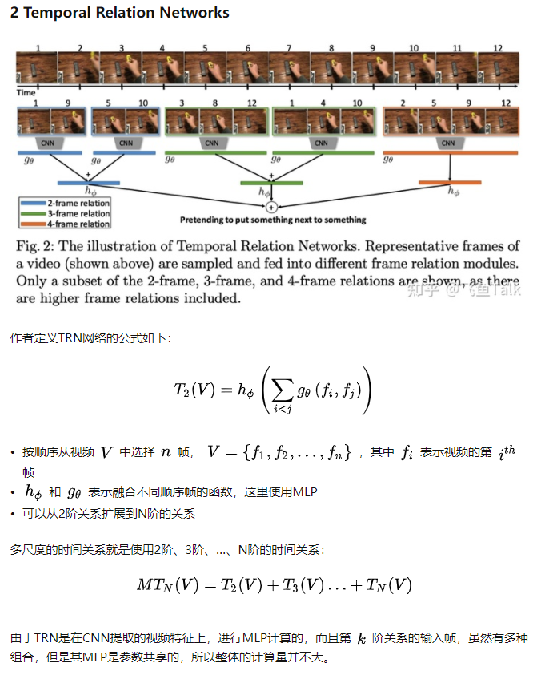
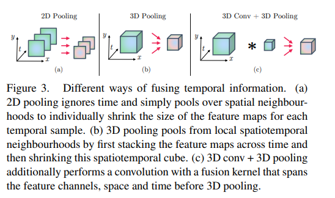

### Top Author

Yu-Gang Jiang, Zuxuan Wu : Fudan University

Lorenzo Torresani, Wang Heng ,Feiszli, Matt: FAIR

Luc Van Gool :  Head Toyota Lab TRACE

Yi Yang : University of Technology Sydney

Kiyoharu Aizawa: University of Tokyo

Ali Diba: KU Leuven

Abdenour Hadid: Ctr Machine Vis & Signal Anal CMVS, Oulu

将Transformer用到视频分类中:

* Video Swin Transformer
* ViViT: A Video Vision Transformer
* Is Space-Time Attention All You Need for Video Understanding?

对特征及进行选择加速模型推理：

* Adaptive Focus for Efficient Video Recognition
* No frame left behind: Full Video Action Recognition(根据相似度不断对2d特征进行聚类，压缩frams)

动作识别中的时间维度建模:

* Slowfast networks for video recognition  (two branch，一个分支学习结构信息，一个分支学习时序信息)
* TSM: Temporal Shift Module for Efficient Video Understanding(让卷积核的一部分沿着时间维度移动，学到时序信息)
* Dynamic image networks for action recognition (15年，使用LSTM+光流信息进行视频分类)
* Rank Pooling for Action Recognition(16年，单独训练一个网络来学习时序信息)

* Video Action Transformer Network(将self-attention用到时序信息的提取中)
* Directional Temporal Modeling for Action Recognition  (学习3D卷积重的clip级别的时序信息)
* EFFICIENT TEMPORAL-SPATIAL FEATURE GROUPING FOR VIDEO ACTION RECOGNITION(重新设计时空解耦的卷积学习特征)
* TEA: Temporal Excitation and Aggregation for Action Recognition(设计TEA block对短时间和长时间分开建模)
* Temporal Pyramid Network for Action Recognition(时间维度的特征金字塔)

Gate-Shift Networks for Video Action Recognition: S3D GST CSN TSM GSM都是对3D卷积核中时间维度的处理

将多模态融合应用到视频分类中：

* Towards Good Practices for Multi-modal Fusion in Large-scale Video Classification(将多模态双线性池化引入用以融合视频和音频的信息)

* 弹幕信息协助下的视频多标签分类  (探索了将弹幕信息融合后对视频进行分类的可能性，自建了从bilibili采集的数据集(后续会开放))

* 基于深度多模态特征融合的短视频分类（通过建立相似性损失和差异性损失，探寻短视频中不同模态之间的相似性和同一模态的差异性来辅助分类）

* Multimodal Keyless Attention Fusion for Video Classification(提出了一种keyless的attetion方法用于特征融合)
* Deep Multimodal Learning: An Effective Method for Video Classification(比较了一些比较常用的循环网络用于特征融合的性能)
* A Deep Learning Based Video Classification System Using Multimodality Correlation Approach（person correlation integration）
* Multi-Stream Multi-Class Fusion of Deep Networks for Video Classification（multi-stream multi-class fusion，通过学习类关系来提高预测性能）
* Modeling Multimodal Clues in a Hybrid Deep Learning Framework for Video Classification (the feature fusion network that produces a fused representation through modeling feature relationships outperforms a large set of alternative fusion strategies)
* Residual Attention-based Fusion for video classification(将BiLSTM和attention堆叠起来用于提取时空特征)

* Multimodal video classification with stacked contractive autoencoders(用autoencoders提取模态之间的互补信息)

[mmaction2](https://github.com/open-mmlab/mmaction2/blob/master/README_zh-CN.md)是一款基于 PyTorch 的视频理解开源工具箱，是 [OpenMMLab](http://openmmlab.org/) 项目的成员之一。

### [综述1](https://kns.cnki.net/kcms/detail/detail.aspx?dbcode=CDFD&dbname=CDFDLAST2021&filename=1020088389.nh&uniplatform=NZKPT&v=I-qi2lPeIGnyDU6ug2XUWTTJ4KMmmokT-gspiml2lup2RduoGE0rsver9FZ9I-go)

在视频数据分析发展之初，研究人员通常针对每一种视频理解任务甚至每一个数据集独立设计方案。

随着视频理解需求种类的逐渐丰富以及视频数据类型的逐步增加，由于不同任务的系统之间存在着相似的步骤与处理方法，于是通过总结视频数据映射到数字空间的步骤，视频特征学习将大多数视频理解任务分解成为两个步骤，即先按照手工设计方案提取视频数据的语义特征，然后再针对不同的任务对语义特征采用不同的处理方案。

同时相关的研究工作也被分为两个方向，即研究如何提取具有描述能力的通用视频特征以及如何在视频特征的基础上解决相应的问题。这样的解决方案极大地加快了视频理解地发展速度，当出现新的任务需求时，只需要从现有地通用特征出发设计出新地特征处理方案就可以完成一个全新地功能。而当更为强大地通用特征被提出时，只需要替换使用地特征就可以全方位地提升视频理解的性能。

近些年随着深度学习的发展，使用深度学习特征替换传统手工设计特征已然成为一种主流趋势。

该方向早期的研究大多是通过在视频帧上应用二维CNN来提取基于图像的深度特征。Karpartjy等人在固定的窗口中提取基于二维CNN的帧级别特征，然后利用时空卷积来融合每一帧的特征。著名的双流体系结构则在视频的帧和光流图上分别应用两个二维CNN结构并将两者的结果进行综合。利用卷积融合、时空注意力机制、TSN和卷积特征编码，这种双流结构在后续的工作中得到进一步的扩展。Ng等人指出了在视频帧上执行二维CNN有一个显著的缺点，即在这种情况下，双流网络无法捕捉特征的长期关联性。为了克服这一局限性，该工作提出了LSTM-RNN模型，对视频中的长时间动态变化进行建模。在其后的工作中，Srivatstava等人进一步将视频特征学习任务建模为基于编码-解码LSTM的自动编码器模型。上述方法由于仅仅将用于特征学习的视频帧为帧序列或者光流序列，像素级的跨连续帧的时空演化并没有被考虑在特征的性质中。为此，Ji等人提出使用三维CNN来端到端地从短视频中学习时空特征。随后地研究中，Tran等人设计了一个被广泛采用地三维CNN结构，即C3D，此外，通过膨胀二维卷积核、分解三维卷积核和聚合残差网络，三维CNN地性能得到进一步提高。

三套体系：3D卷积体系，双流体系，LSTM体系

除了上述基于 C3D 模型的一系列研究工作，很多研究者也探索了其他形式的卷积网络在视频分析中的应用。赵岳等人从传统方法中得到启发，提出了轨迹卷积 (Trajectory Convolution) 网络，利用视频时序上沿着轨迹的偏移量实现可变形卷积操作。由物体运动的快慢得到启发，Feichtenhofer 等人提出了快慢型网络 (SlowFast Network)，分别利用两路网络处理对应于不同帧率的输入，综合提取空间语义和运动信息。

在计算机视觉研究中，上下文通常指视觉数据中某个主体 (如图片物体或视频行为) 周围的信息。作为重要的视觉信息来源，上下文可以为视频理解研究提供主体与背景或主体与其他主体之间的联系。很多研究者都建议将时空上下文融入视频分析模型中，以进一步地提升视频分类性能。在文献 [44] (What do 15,000 Object CategoriesTell Us About Classifying and Localizing Actions? CVPR 2015 )中，Jain 等人观察到视频中某类动作总是对应着检测到某几种物体的共同出现，如遛狗这个动作通常会出现人和狗，进而研究了视频动作与某些类别物体之间的上下文关系。在文献 [45] (Harnessing Object and Scene Semantics forLarge-Scale Video Understanding CVPR 2016)中，吴祖煊等人指出视频动作与物体及场景都存在着语义联系，通过实验证明利用这种上下文关系可以有效改善视频分类效果。为了对视频中物体在时序上的上下文依赖关系建模，周博磊等人提出了时序关系推理网络 (TemporalRelational Reasoning Network, TRN)(Proceedings of the European Conference on Computer Vision ECCV 2018) 来提取视频特征。受益于时序上下文，该模型对于在时序上具有一定方向性的动作，分类效果的提升尤为明显。

[综述2](https://zhuanlan.zhihu.com/p/422235052)

**2.1 动作识别简介**

动作识别的目标是识别出视频中出现的动作，通常是视频中人的动作。视频可以看作是由一组图像帧按时间顺序排列而成的数据结构，比图像多了一个时间维度。动作识别不仅要分析视频中每帧图像的内容，还需要从视频帧之间的时序信息中挖掘线索。动作识别是视频理解的核心领域，虽然动作识别主要是识别视频中人的动作，但是该领域发展出来的算法大多数不特定针对人，也可以用于其他视频分类场景。

动作识别看上去似乎是图像分类领域向视频领域的一个自然延伸，深度学习尽管在图像分类领域取得了举世瞩目的成功，目前深度学习算法在图像分类上的准确率已经超过普通人的水平，但是，深度学习在动作识别领域的进展并不像在图像分类领域那么显著，很长一段时间基于深度学习算法的动作识别准确率达不到或只能接近传统动作识别算法的准确率。概括地讲，动作识别面临以下几点困难:

- 训练视频模型所需的计算量比图像大了一个量级，这使得视频模型的训练时长和训练所需的硬件资源相比图像大了很多，导致难以快速用实验进行验证和迭代；
- 在 2017 年，Kinetics 数据集 (Carreira & Zisserman, 2017) 诞生之前， 缺少大规模通用的视频基准 (Benchmark) 数据集。在很长一段时间里，研究者都是在如 UCF-101 数据集 (Soomro et al., 2012) 上比较算法准 确率，而 UCF-101 只有 1.3 万条数据，共 101 个类别，平均每个类别只有约 100 个视频，相比于图像分类领域的 ImageNet 数据集有 128 万 条数据，共 1000 个类别，平均每个类别约有 1,000 个视频，UCF-101 数据集显得十分小。数据集规模制约了动作识别领域的发展；
- 学习视频中帧之间的时序关系，尤其是长距离的时序关系，本身就比较难。不同类型的动作变化快慢和持续时长有所不同，不同的人做同一个动作的方式也存在不同，同时相机拍摄角度和相机自身的运动也会对识别带来挑战。此外，不是视频中所有的帧对于动作识别都有相同的作用，有许多帧存在信息冗余；
- 网络结构设计缺少公认的方案。图像分类领域的网络结构设计有一些公认的指导理念，例如，端到端训练、小卷积核、从输入到输出空间分辨率不断降低且通道数不断增大等。然而，在动作识别领域，同时存在多个网络设计理念，例如，帧之间的时序关系应该如何捕捉、使用 2D 卷积还是 3D 卷积、不同帧的特征应该如何融合等都还没有定论。

**2.2 基于 2D 卷积的动作识别**

视频是由一系列图像帧（Frame）组成的，图像分类模型经过这些年的发展已经相对成熟。如何进行视频分类呢？一种直观的想法是将图像分类的模型直接运用到视频分类中。如下图所示，一个简单的想法是先把视频各帧提取出来，每帧图像各自前馈（Feedforward）一个图像分类模型，不同帧的图像分类模型之间相互共享参数。得到每帧图像的特征之后，对各帧图像特征进行汇合（Pooling），例如采用平均汇合，得到固定维度的视频特征，最后经过一个全连接层和 Softmax 激活函数进行分类以得到视频的类别预测。

平均汇合方法十分简单，其视频分类的准确率与其他同时期专门为动作识别设计的深度学习模型相比差距并不大 (Karpathy et al., 2014) ，但是与传统动作识别算法的准确率相比还有很大差距，不过后来专门为动作识别设计的深度学习模型的准确率高了很多。

最直观的想法是先把视频拆成一帧帧的图像，每帧图像各自用一个图像分类模型得到帧级别的特征，然后用某种汇合方法从帧级别特征得到视频级别特征，最后进行分类预测，其中的汇合方法包括: 平均汇合、NetVLAD/NeXtVLAD、NetFV、RNN、3D 卷积等。另外，我们可以借助一些传统算法来补充时序关系，例如，双流法利用光流显式地计算帧之间的运动关系，TDD 利用 iDT 计算的轨迹进行汇合等。基于 2D 卷积的动作识别方法的一个优点是可以快速吸收图像分类领域的最新成果，通过改变骨架网络，新的图像分类模型可以十分方便地迁移到基于 2D 卷积的动作识别方法中。

**2.3 基于 3D 卷积的动作识别**

另一方面，图像是三维的，而视频比图像多了一维，是四维。图像使用的是 2D 卷积，因此视频使用的是 3D 卷积。我们可以设计对应的 3D 卷积神经网络，就像在图像分类中利用 2D 卷积可以从图像中学习到复杂的图像表示一样，利用 3D 卷积可以从视频片段中同时学习图像特征和相邻帧之间复杂的时序特征，最后利用学到的高层级特征进行分类。

相比于 2D 卷积，3D 卷积可以学习到视频帧之间的时序关系。我们可以将 2D 卷积神经网络扩展为对应的 3D 卷积神经网络，如 C3D、Res3D/3D ResNet、LTC、I3D 等。由于 3D 卷积神经网络的参数量和计算量比 2D 卷积神经网络大了很多，不少研究工作专注于对 3D 卷积进行低秩近似，如 FSTCN、P3D、R(2+1)D、S3D 等。TSM 对 2D 卷积进行改造以近似 3D 卷积的效果。3D 卷积 + RNN、ARTNet、Non-Local、SlowFast 等从不同角度学习视频帧之间的时序关系。此外，多网格训练和 X3D 等对 3D 卷积神经网络的超参数进行调整，使网络更加精简和高效。

深度学习的视频特征：

双流体系：

[Two-Stream Convolutional Networks for Action Recognition in Videos(Nips 2014)](https://arxiv.org/pdf/1406.2199.pdf):著名的双流体系结构在视频的帧和光流图上分别应用两个二维CNN结构并将两者的结果进行综合。Spatial stream ConvNet的输入是单张图像，用来对目标和场景的appearance提取特征(有些action的识别依赖单张图像，有些则必须依赖运动和时间特征)。Temporal Stream ConvNet的输入是多张相邻帧的光流，对motion特征进行表示。

[Convolutional Two-Stream Network Fusion for Video Action Recognition(cvpr 2016)](https://openaccess.thecvf.com/content_cvpr_2016/papers/Feichtenhofer_Convolutional_Two-Stream_Network_CVPR_2016_paper.pdf):在双流体系结构的基础上讨论了不同的fusion方法。在卷积的过程中进行特征融合相对于在softmax层进行特征融合会提高性能。

[Temporal Segment Networks: Towards Good Practices for Deep Action Recognition(ECCV2016)](https://link.springer.com/chapter/10.1007/978-3-319-46484-8_2):由于相邻的帧有信息冗余，所以密采样是不需要的。TSN采用稀疏采样的策略利用整个视频的信息。具体来说，TSN把视频分成3段，每个片段均匀地随机采样一个视频片段，并使用双流网络得到视频片段属于各类得分(softmax之前的值)，之后把不同片段得分取平均，最后通过softmax输出。本文还尝试了RGB difference 和 warped optical flow两种模态。RGB difference可以认为是对图像运动信息的一个粗略估计，而warped光流借鉴经典iDT的思路，试图对相机位移作一估计并对光流进行补偿，使得光流代表的运动信息更集中在前景目标上。

[Temporal Segment Networks for Action Recognition in Videos(TPAMI2018)](https://ieeexplore.ieee.org/abstract/document/8454294):文章主要工作是在16年TSN的基础上继续做的，提出了5种分段一致性聚合函数，三种基本形式：average-pooling， max pooling，weighted average,两种高级方案：top-k pooling 和adaptive attention weighting。

为了将学习到的TSN用于未经修剪过的视频，提出了分层聚合策略Multi-scale Temporal Window Intergration(M-TWI)
延续TSN的思想，该策略的原理为：首先将未修剪的视频分成一系列具有固定持续时间的短窗口，然后，对每个窗口进行独立的动作识别，对这些片段级的动作识别分数用max pooling操作 ，最后根据TSN网络框架的聚合功能，采用top-k或者adaptive attention weighting来聚合这些窗口的预测，从而产生视频级的预测结果。由于该聚合模块具有隐式地选择具有区分动作实例的区间，同时抑制噪声背景干扰的能力，所以对于非约束视频识别是有效的。

详细内容参考:https://blog.csdn.net/vincent_zbt/article/details/83062094

TSN则是对每帧图像进行分类，对分类结果求均值。该模型没有任何的时间编码能力，最后的预测结果也与帧的时序无关。

[Unified Spatio-Temporal Attention Networks for Action Recognition in Videos(TMM2019)](https://ieeexplore.ieee.org/abstract/document/8424031):在双流结构的基础上引入时空注意力机制

[Deep Temporal Linear Encoding Networks(CVPR2017)](https://openaccess.thecvf.com/content_cvpr_2017/papers/Diba_Deep_Temporal_Linear_CVPR_2017_paper.pdf)传统用CNN提取视频特征的时候都是分别用其对于视频的时序和空间特征进行建模，这种方法局限于只能表征一个较短的序列（我对这种说法的理解是可能的原因是如果帧过多的话参数过多、如果取帧的间隔过大的话建模效果会降低），本文就提出了一种新的建模和表征方法来提取整个视频的运动信息，并将其嵌入到传统的CNN里。对于一个视频序列V而言，假如其由K帧组成，然后经过一个CNN之后可以得到K个大小为h*w*c的feature map，然后接下来作者对于K个特征图进行融合，并分别进行试验对比了相加、相乘、取最大的操作，最终得到相乘的效果是最好的。然后就可以得到一个h*w*x的融合后的特征图。

下一步需要做的是对这个融合后的特征图进行编码并最终得到一个向量的表征。

详细解读参考:https://blog.csdn.net/zxcvbnm2333/article/details/86489859 和 https://zhuanlan.zhihu.com/p/266383350

[SlowFast Networks for Video Recognition(ICCV2019)](https://arxiv.org/pdf/1812.03982.pdf):提出了用于视频分类的快慢结合的Two-Stream模型：（1）Slow网络，输入低帧率，用于提取空间语义信息；（2）Fast网络，输入高帧率，用于提取运动信息。因为，Fast网络的输入是高帧率的，为了减少计算量，作者设计成轻量级的Fast网络模型，减少了Fast网络的通道数。

详细解读参考:https://zhuanlan.zhihu.com/p/382763075

[Temporal Relational Reasoning in Videos(ECCV2018)](http://relation.csail.mit.edu/):

详细解读见：https://zhuanlan.zhihu.com/p/383750515

3DCNN:

[Learning Spatiotemporal Features With 3D Convolutional Networks(ICCV2015)](https://openaccess.thecvf.com/content_iccv_2015/html/Tran_Learning_Spatiotemporal_Features_ICCV_2015_paper.html) C3D 作者提出了基于3D卷积核的深度卷积神经网络，主要有三大贡献：

1. 3D卷积相比2D卷积，更适合于提取时空特征
2. 通过实验证明了一种基于3D卷积核构建的最优深度卷积模型
3. 通过该模型学习到的特征，后面接上简单的线性分类器，在4个不同的benchmark数据集上取得了很好的效果

详细解读参考: https://zhuanlan.zhihu.com/p/378713640

C3D在缺乏足够大数据集的情况下进行大规模训练，性能一般不佳。而且模型训练过程涉及大量的参数和计算量

[Learning Spatio-Temporal Representation with Pseudo-3D Residual Networks(ICCV2017)](https://openaccess.thecvf.com/content_ICCV_2017/papers/Qiu_Learning_Spatio-Temporal_Representation_ICCV_2017_paper.pdf) P3D

作者认为，之前提出的3D卷积核对于提取时空特征有帮助，带来的代价是，3D卷积核的参数量和计算量比2D卷积核大很多。**作者指出，为什么不直接基于现有的2D深度卷积神经网络来设计3D深度卷积神经网络呢？做法就是：将3x3x3的卷积核，分解为1x3x3的空间卷积核和3x1x1的时间卷积核。**作者将1x3x3的空间卷积核和3x1x1的时间卷积核，替换ResNet模型的2D卷积核，提出了Pseudo-3D Residual Net(P3D ResNet)。该模型在Sports-1M 视频分类数据集上，对比3D CNN和基于帧的2D CNN分别提升5.3%和1.8%

详细解读参考:https://zhuanlan.zhihu.com/p/379309884

[Quo Vadis, Action Recognition? A New Model and the Kinetics Dataset(CVPR2017)](https://arxiv.org/abs/1705.07750):I3D目前，大部分动作识别模型在UCF-101和HMDB-51两个数据集上的指标都很接近了，判断不出来哪个模型效果更好。作者在Kinetics这个更大的动作识别数据集上，验证不同模型结构的性能。此外，作者还提出了一种新的网络结构，Two-Stream Inflated 3D ConvNet(I3D)。该模型通过对2D卷积模型的卷积层和池化层进行时间维度上的扩充，使得模型可以从视频中无缝的提取到时空特征。

详细解读参考:https://zhuanlan.zhihu.com/p/379951287

[A closer look at spatiotemporal convolutions for action recognition.(CVPR2018)](https://openaccess.thecvf.com/content_cvpr_2018/html/Tran_A_Closer_Look_CVPR_2018_paper.html)R(2+1D) 在本文中，作者研究了用于视频分析的几种时空卷积，并研究他们对动作识别的作用。作者发现，直接对视频帧采用2D卷积网络提取特征， 并进行动作识别也能取得不错的效果。作者本文主要贡献： 

1. 在残差学习的框架下，证明了3D CNN相对于2D CNN的确定性优势 
2. 将3D卷积分解成时间卷积 + 空间卷积能够提升模型效果 

详细解读参考:https://zhuanlan.zhihu.com/p/433384677

C3D最早广泛使用，I3D膨胀二维卷积核，P3D和R(2+1)D是分解三维卷积核

[Video Classification with Channel-Separated Convolutional Networks(iccv 2019)](https://openaccess.thecvf.com/content_ICCV_2019/papers/Tran_Video_Classification_With_Channel-Separated_Convolutional_Networks_ICCV_2019_paper.pdf):

这篇文章主要研究了不同的分组3D卷积设计是如何影响视频分类任务的。作者认为通道之间的互相交流（channel interaction）对于分类任务的准确率扮演着很重要的作用，对此他们有两大主要发现 ：

1. 分解3D卷积通过分开通道间相互作用和时空域信息的交互将对于提高准确率和节省计算量有很好的帮助。
2. 将3D卷积进行通道分离这种方法从某种程度上说可以等效成一种正则化，虽然在训练集上的准确率不高，但在测试集上表现出跟高的准确率。

对此这两大发现，作者设计出了一种名为通道分离卷积网络（CSN），它简易、精准而且快速（相比其它SOTA方法可以提高2-3倍速度），并且准确率可以达到SOTA。

详细解读参考：https://zhuanlan.zhihu.com/p/143765575

(3D卷积变形？)关于TSM,TIN,GSN,GSM几个运用Shift思想的网络的解读:https://zhuanlan.zhihu.com/p/137385332

### 数据集:

| 年份 | 数据集名称      | paper                                                        | 类别数 | 视频数        |
| ---- | --------------- | ------------------------------------------------------------ | ------ | ------------- |
| 2004 | KTH             | Recognizing human actions: a local svm approach              | 6      | 600           |
| 2005 | Weizmann        | Actions as space-time shapes                                 | 9      | 81            |
| 2008 |                 | Action mach: a spatio-temporal  maximum average correlation     height filter for action recognition. |        |               |
| 2008 | Hoollywood      |                                                              | 8      | 663           |
| 2011 | HMDB            | HMDB:  A large video database for human motion recognition   | 51     | 6766          |
| 2012 | UCF101          | UCF101: A     dataset of 101 human actions classes from videos in the wild | 101    | 13320         |
| 2013 |                 | Towards understanding action recognition                     |        |               |
| 2014 |                 | Jhu-isi gesture and skill  assessment working set (jigsaws): A surgical activity dataset for human  motion modeling. |        |               |
| 2014 |                 | The language     of actions: Recovering the syntax and semantics of goaldirected human  activities |        |               |
| 2014 | MPII HPD        |                                                              | 410    | 24920         |
| 2015 | ActivityNet     | ActivityNet: A large-scale video benchmark for human activity  understanding | 200    | 28K           |
| 2015 |                 | THUMOS challenge:Action  recognition with a large number of classes |        |               |
| 2016 |                 | Hollywood in     homes: Crowdsourcing data collection for activity understanding. |        |               |
| 2016 |                 | Human action localization with  sparse spatial supervision   |        |               |
| 2016 |                 | Spot on: Action localization  from pointly-supervised proposals |        |               |
| 2016 |                 | Recognizing fine-grained and  composite activities using hand-centric features and script data. |        |               |
| 2017 | Kinetics-400    | Quo vadis, action     recognition? a new model and the kinetics dataset | 400    | 305128        |
| 2017 |                 | The something something  video     database for learning and evaluating visual common sense | 174    | 108.5K/220.8K |
| 2017 | Youtube8M       |                                                              | 4800   | 8264650       |
| 2018 |                 | Every moment counts:     Dense detailed labeling of actions in complex videos. |        |               |
| 2018 |                 | What do i annotate next? an  empirical     study of active learning for action localization. |        |               |
| 2018 |                 | Ava: A video dataset of  spatio-temporally localized atomic     visual actions |        |               |
| 2018 |                 | Scaling egocentric vision: The  epic-kitchens     dataset.   |        |               |
| 2019 | Moments in Time | Moments     in time dataset: one million videos for event understanding | 339    | 836114        |
| 2019 |                 | Hacs: Human action clips and  segments dataset     for recognition and temporal localization |        |               |
| 2019 | Diving48        | Resound: Towards action  recognition without representation bias. |        |               |
| 2019 | Jester          | The Jester Dataset: A  Large-Scale Video Dataset of Human Gestures |        |               |
| 2020 | FineGYM         | FineGym: A Hierarchical Video  Dataset for Fine-grained Action Understanding |        |               |
| 2020 | OmniSource      | Omni-sourced Webly-supervised  Learning for Video Recognition |        |               |
| 2020 | HVU             | Large Scale Holistic Video  Understanding                    | 739    | 572K          |

- [ UCF101](https://github.com/open-mmlab/mmaction2/blob/master/tools/data/ucf101/README_zh-CN.md) ([主页](https://www.crcv.ucf.edu/research/data-sets/ucf101/)) (CRCV-IR-12-01) (Soomro, Roshan Zamir, and Shah 2012) is a trimmed video dataset, consisting of realistic web videos with diverse forms of camera motion and illumination. It contains 13,320 video clips with an average length of 180 frames per clip. These are labeled with 101 action classes, ranging from daily life activities to unusual sports. Each video clip is assigned just a single class label. Following the original evaluation scheme, we report the average accuracy over three training/testing splits.
- [ ActivityNet](https://github.com/open-mmlab/mmaction2/blob/master/tools/data/activitynet/README_zh-CN.md) ([主页](http://activity-net.org/)) (CVPR'2015) (Heilbron et al. 2015) is an untrimmed video dataset. We use the ActivityNet v1.3 release, which consists of more than 648 hours of untrimmed videos from a total of around 20K videos with 1.5 annotations per video, selected from 200 classes. Videos can contain more than one activity, and, typically, large time segments of a video are not related to any activity of interest. In the official split, the distribution among training, validation, and test data is about 50%, 25%, and 25% of the total videos, respectively. Because the annotations for the testing split have not yet been published, we report experimental results on the validation split.
- [Kinetics-[400/600/700\]](https://github.com/open-mmlab/mmaction2/blob/master/tools/data/kinetics/README_zh-CN.md) ([主页](https://deepmind.com/research/open-source/kinetics/)) (CVPR'2017) (Carreira and Zisserman 2017) is a trimmed video dataset. The dataset contains 246,535 training videos, 19,907 validation videos, and 38,685 test videos, covering 400 human action classes. Each clip lasts around 10s and is labeled with a single class. The annotations for the test split have not yet been released, so we report experimental results on the validation split.
- YouTube-8M (Abu-El-Haija et al. 2016) is massively large untrimmed video dataset. It contains over 1.9 billion video frames and 8 million videos. Each video can be annotated with multiple tags. Visual and audio features have been preextracted and are provided with the dataset for each second of the video. The visual features were obtained via a Google Inception CNN pre-trained on ImageNet (Deng et al. 2009), followed by PCA-based compression into a 1024- dimensional vector. The audio features were extracted via a pre-trained VGG-inspired (Simonyan and Zisserman 2014a) network. In the official split, the distribution among training, validation, and test data is about 70%, 20%, and 10%, respectively. As the annotations of the test split have not been released to the public and the number of videos in the validation set is overly large, we maintain 60K videos from the official validation set to validate the parameters. Other videos in the validation set are included into the training set. We report experimental res
- [Moments in Time](https://github.com/open-mmlab/mmaction2/blob/master/tools/data/mit/README_zh-CN.md) ([主页](http://moments.csail.mit.edu/)) (TPAMI'2019) consists of 800 000, 3-second YouTube clips that capture the gist of a dynamic scene involving animals, objects, people, or natural phenomena.
- Something-Something v2 (SSv2) [26] contains 220 000 videos, with durations ranging from 2 to 6 seconds. In contrast to the other datasets, the objects and backgrounds in the videos are consistent across different action classes, and this dataset thus places more emphasis on a model’s ability to recognise fine-grained motion cues.
- Epic Kitchens-100 consists of egocentric videos capturing daily kitchen activities spanning 100 hours and 90 000 clips . We report results following the standard “action recognition” protocol. Here, each video is labelled with a “verb” and a “noun” and we therefore predict both categories using a single network with two “heads”. The topscoring verb and action pair predicted by the network form an “action”, and action accuracy is the primary metric.

[Video Dataset Overview](https://www.di.ens.fr/~miech/datasetviz/)

[Video Action Understanding](https://arxiv.org/pdf/2010.06647.pdf)

### 文章内容

在Convolutional Two-Stream Network Fusion for Video Action Recognition(cvpr 2016)中提到的一些做法

一些可行的fusion方法:Max, Sum, Concatenation and Conv, Bilinear fusion,  taking the pixel wise product of channels(instead of their sum or max)

`Sum fusion`: 按对应channel进行矩阵对应位置元素加和，通道数为D。

`Max fusion`: 按对应channel进行矩阵对应位置元素取最大值，通道数为D。

`Concatenation fusion`: 将channel堆叠起来，通道数为2D。

`Conv fusion`: 先将channel堆叠起来，在用1×1的卷积做通道压缩，通道数为D。

`Bilinear fusion`: 遍历channel计算矩阵乘法，会导致通道数骤增，通道数为D×D。说好点是对所有信息融合，说坏点就是分不清主次。

### 相关比赛

[2021年腾讯广告算法大赛](https://algo.qq.com/)

01.视频广告秒级语义解析

02.多模态视频广告标签

两个任务均以视频，音频、文本三个模态作为输入，参赛选手利用模型对广告进行理解。

在任务一中，对于给定测试视频样本，通过算法将视频在时序上进行“幕”的分段，并且预测出每一段在呈现形式、场景、风格等三个维度上的标签，使用Mean Average Precision(MAP)进行评分。

在任务二中，对于给定的测试视频样本，通过算法预测出视频在呈现形式、场景、风格等三个维度上的标签，使用Global Average Precision(GAP)进行评分。

任务一找不到开源实现

任务二开源实现

[第十名](https://github.com/beibuwandeluori/taac2021-tagging-azx)

引入nextvald聚合数据，使用多种VIT预训练模型提取模型特征

[第六名](https://github.com/chenjiashuo123/TAAC-2021-Task2-Rank6)

使用Bi-Modal Transformer对不同模态进行融合，将融合后特征用nextvald再一次聚合，得到最终特征进行预测

[第二十七名](https://github.com/XIUXIUXIUBIUA/TAAC-2021)

[baseline](https://github.com/LJoson/TAAC_2021_baseline)

达尔文团队方案(无代码实现，但方案简单)：

将提取的多模态特征分别输入到NeXtVLAD模块中，不同模态之间的不同之处在于dropout的取值不同，通过控制 dropout 的取值来调节不同模态的贡献程度，其中视频和音频特征的 dropout 为 0.95，文本特征的 dropout 为 0.85。  

